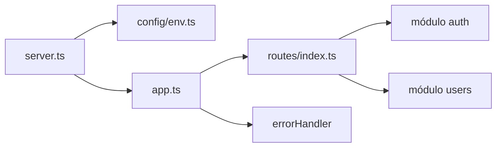

# medicine-back

Backend del **sistema médico de prestaciones domiciliarias**: API REST con **Node.js**, **TypeScript**, **Express**, **Prisma**, autenticación **JWT**, validación con **Zod** y capas separadas (controlador → servicio → repositorio).

---

## Cómo arranca la aplicación

1. `**src/server.ts`** carga variables con `dotenv` y lee el puerto desde `src/config/env.ts` (validado con Zod). Si falta alguna variable obligatoria o es inválida, el proceso termina con error claro.
2. Se construye la app con `**src/app.ts`** (`createApp()`): middlewares globales, montaje de rutas y manejadores de error al final.
3. Se crea un servidor HTTP (`node:http`) que escucha en `**PORT**` (por defecto `3000`).




---

## Arquitectura y responsabilidades

Cada **módulo de dominio** vive en `src/modules/<nombre>/` y sigue el mismo patrón:


| Capa         | Archivo típico            | Rol                                                                                             |
| ------------ | ------------------------- | ----------------------------------------------------------------------------------------------- |
| Rutas        | `*.routes.ts`             | Define URL, método HTTP, rate limits y encadena middlewares (`authenticate`, `authorizeRoles`). |
| Controlador  | `*.controller.ts`         | Parsea entrada (Zod), llama al servicio, devuelve JSON con forma consistente.                   |
| Servicio     | `*.service.ts`            | Reglas de negocio, orquestación; no conoce detalles HTTP.                                       |
| Repositorio  | `*.repository.ts`         | Consultas y transacciones con Prisma.                                                           |
| Validación   | `*.validation.ts`         | Esquemas Zod (body, query, params).                                                             |
| DTO / mapper | `*.dto.ts`, `*.mapper.ts` | Forma de las respuestas y mapeo desde modelos Prisma (por ejemplo, sin exponer `passwordHash`). |


Lo **transversal** (no pertenece a un solo dominio) está en `src/core/` (errores, `wrapAsync`, middlewares de auth/RBAC) y `src/shared/` (cliente Prisma, JWT, bcrypt, includes reutilizables).

---

## Flujo de autenticación y permisos

1. **Registro** (`POST /api/v1/auth/register`): crea usuario con contraseña hasheada (**bcrypt**) y asigna el rol **OPERADOR** (debe existir en BD; el seed lo crea).
2. **Login** (`POST /api/v1/auth/login`): valida credenciales y devuelve un **access token** JWT (incluye un `jti` único por sesión).
3. **Logout** (`POST /api/v1/auth/logout`): revoca el token actual en servidor (blacklist hasta su expiración). El front debe borrar el token local igualmente.
4. Rutas protegidas envían el header `Authorization: Bearer <token>`.
5. El middleware `**authenticate`** verifica el JWT, comprueba que **no esté revocado** y carga el usuario y sus **roles actuales** desde la base.
6. `**authorizeRoles(...)`** comprueba que el usuario tenga al menos uno de los roles permitidos en esa ruta.

Roles sembrados por defecto (`prisma/seed.ts`): **ADMIN**, **OPERADOR**, **PRESTADOR**.

### Usuarios de prueba (solo desarrollo)

Se crean al ejecutar `**npx prisma db seed`** (o `npm run db:seed`). Están definidos en `**prisma/seed.ts`**.


| Email                      | Rol       | Contraseña (todas igual) |
| -------------------------- | --------- | ------------------------ |
| `admin@medicine.local`     | ADMIN     | `MedicineTest1!`         |
| `operador@medicine.local`  | OPERADOR  | `MedicineTest1!`         |
| `prestador@medicine.local` | PRESTADOR | `MedicineTest1!`         |


Login: `POST /api/v1/auth/login` con `{ "email": "...", "password": "MedicineTest1!" }`.

El usuario `prestador@medicine.local` además recibe una fila en la tabla `**prestadores**` (datos profesionales) al correr el seed.

**Importante:** no uses estas credenciales en producción; el seed es para entorno local / demos.

### Prestadores (modelo)

Un **prestador** es la combinación de:

1. `**users`** — cuenta (nombre, email, contraseña, `estado` para login).
2. `**user_roles`** — rol `PRESTADOR`.
3. `**prestadores**` — perfil profesional (`telefono`, `lugar_residencia`, `documento`, `matricula`, `cuit`, `estado` del prestador).

Relación: `prestadores.user_id` → `users.id` (1:1).

---

## Formato de respuestas y errores

**Éxito:**

```json
{ "success": true, "data": { ... } }
```

**Error controlado** (validación, auth, conflicto, etc.):

```json
{ "success": false, "error": { "code": "UNAUTHORIZED", "message": "...", "details": {} } }
```

Los errores de **Zod** llegan como `code: "VALIDATION_ERROR"` con `details` en forma aplanada. El manejador central está en `src/core/errors/errorHandler.ts`.

---

## Base de datos

- El proyecto está preparado para desarrollo con **SQLite**: archivo local `prisma/dev.db` (sin servidor de base de datos).
- `DATABASE_URL` debe usar el protocolo `file:` (ver `.env.example`).
- Tras cambiar el `schema.prisma` o el proveedor, ejecutá `**npx prisma generate`** antes de correr la app o el seed.

Para **producción** con PostgreSQL habrá que volver a `provider = "postgresql"`, ajustar la URL y regenerar migraciones según la estrategia del equipo.

---

## Variables de entorno


| Variable             | Descripción                                       |
| -------------------- | ------------------------------------------------- |
| `NODE_ENV`           | `development`                                     |
| `PORT`               | Puerto HTTP (por defecto `3000`).                 |
| `DATABASE_URL`       | SQLite: `file:./dev.db` (archivo bajo `prisma/`). |
| `JWT_SECRET`         | Secreto de firma; **mínimo 32 caracteres**.       |
| `JWT_EXPIRES_IN`     | Caducidad del access token (ej. `8h`).            |
| `BCRYPT_SALT_ROUNDS` | Entre `10` y `15` (por defecto `12`).             |


Copiá la plantilla: `cp .env.example .env` y completá valores reales.

---

## Requisitos

- **Node.js** ≥ 20  
- **npm** (u otro gestor compatible)

---

## Puesta en marcha

```bash
npm install
cp .env.example .env
npx prisma migrate deploy
npx prisma generate
npx prisma db seed
npm run dev
```

- API versionada bajo `**/api/v1**`.
- Comprobación rápida: `**GET /health**` → `{ "success": true, "data": { "status": "ok" } }`.

**Producción** (tras `npm run build`):

```bash
npm start
```

---

## API (resumen)

Base URL: `http://localhost:<PORT>`


| Método | Ruta                                              | Auth   | Roles                      | Descripción                                                                           |
| ------ | ------------------------------------------------- | ------ | -------------------------- | ------------------------------------------------------------------------------------- |
| GET    | `/health`                                         | No     | —                          | Estado del servicio.                                                                  |
| POST   | `/api/v1/auth/register`                           | No     | —                          | Alta de usuario (rol OPERADOR).                                                       |
| POST   | `/api/v1/auth/login`                              | No     | —                          | Login; devuelve `accessToken` y datos públicos del usuario.                           |
| POST   | `/api/v1/auth/logout`                             | Bearer | —                          | Cierra sesión: invalida el token en servidor.                                         |
| GET    | `/api/v1/auth/me`                                 | Bearer | —                          | Perfil del usuario autenticado.                                                       |
| GET    | `/api/v1/prestadores`                             | Bearer | ADMIN                      | Listado paginado de prestadores (tabla `prestadores` + datos de `users`).             |
| GET    | `/api/v1/prestadores/me`                          | Bearer | PRESTADOR                  | Perfil del prestador autenticado (`PrestadorListItemDto`). 404 si no hay fila.        |
| POST   | `/api/v1/prestadores`                             | Bearer | ADMIN                      | Alta: `User` PRESTADOR + `prestadores` (`cbu`, `regimenIva`, etc.).                   |
| GET    | `/api/v1/insumos`                                 | Bearer | ADMIN, OPERADOR, PRESTADOR | Listado paginado (`?bajoStock=true` opcional).                                        |
| GET    | `/api/v1/insumos/:id`                             | Bearer | ADMIN, OPERADOR, PRESTADOR | Detalle de insumo.                                                                    |
| POST   | `/api/v1/insumos`                                 | Bearer | ADMIN                      | Alta de insumo.                                                                       |
| PATCH  | `/api/v1/insumos/:id`                             | Bearer | ADMIN                      | Actualización de insumo / stock manual.                                               |
| DELETE | `/api/v1/insumos/:id`                             | Bearer | ADMIN                      | Baja de insumo (falla si tiene consumos en visitas).                                  |
| GET    | `/api/v1/obras-sociales`                          | Bearer | ADMIN, OPERADOR, PRESTADOR | Catálogo de obras sociales (`search`, `estado` opcionales).                           |
| GET    | `/api/v1/obras-sociales/:id`                      | Bearer | ADMIN, OPERADOR, PRESTADOR | Detalle de obra social.                                                               |
| POST   | `/api/v1/obras-sociales`                          | Bearer | ADMIN                      | Alta (`nombre`, `codigo`, `estado`).                                                  |
| PATCH  | `/api/v1/obras-sociales/:id`                      | Bearer | ADMIN                      | Actualización parcial.                                                                |
| DELETE | `/api/v1/obras-sociales/:id`                      | Bearer | ADMIN                      | Baja (falla si tiene pacientes).                                                      |
| GET    | `/api/v1/pacientes`                               | Bearer | ADMIN, OPERADOR, PRESTADOR | Listado paginado (`page`, `pageSize`).                                                |
| POST   | `/api/v1/pacientes`                               | Bearer | ADMIN, OPERADOR            | Alta con `obraSocialId`; genera `codigoQr` y `qrDataUrl`.                             |
| GET    | `/api/v1/pacientes/:id`                           | Bearer | ADMIN, OPERADOR, PRESTADOR | Detalle + QR + `servicios` asignados con `tarifas` por modalidad.                     |
| GET    | `/api/v1/pacientes/qr/:codigoQr`                  | Bearer | ADMIN, OPERADOR, PRESTADOR | Búsqueda por escaneo (`PAC-000001`).                                                  |
| PATCH  | `/api/v1/pacientes/:id`                           | Bearer | ADMIN, OPERADOR            | Actualización parcial (`codigoQr` no editable).                                       |
| DELETE | `/api/v1/pacientes/:id`                           | Bearer | ADMIN                      | Baja (falla si tiene visitas o asignaciones paciente-servicio).                       |
| GET    | `/api/v1/historias-clinicas`                      | Bearer | ADMIN, OPERADOR, PRESTADOR | Listado paginado (`page`, `pageSize`, `pacienteId` opcional).                         |
| GET    | `/api/v1/historias-clinicas/paciente/:pacienteId` | Bearer | ADMIN, OPERADOR, PRESTADOR | Historia del paciente con `evoluciones` (relación 1:1).                               |
| GET    | `/api/v1/historias-clinicas/:id`                  | Bearer | ADMIN, OPERADOR, PRESTADOR | Detalle con resumen del paciente y `evoluciones`.                                     |
| POST   | `/api/v1/historias-clinicas`                      | Bearer | ADMIN, OPERADOR            | Alta (un paciente solo puede tener una).                                              |
| PATCH  | `/api/v1/historias-clinicas/:id`                  | Bearer | ADMIN, OPERADOR            | Actualización parcial.                                                                |
| DELETE | `/api/v1/historias-clinicas/:id`                  | Bearer | ADMIN                      | Baja.                                                                                 |
| GET    | `/api/v1/evoluciones-clinicas`                    | Bearer | ADMIN, OPERADOR, PRESTADOR | Listado paginado (`historiaClinicaId` opcional).                                      |
| GET    | `/api/v1/evoluciones-clinicas/:id`                | Bearer | ADMIN, OPERADOR, PRESTADOR | Detalle.                                                                              |
| POST   | `/api/v1/evoluciones-clinicas`                    | Bearer | ADMIN, OPERADOR            | Alta de evolución (misma política que historias clínicas).                            |
| PATCH  | `/api/v1/evoluciones-clinicas/:id`                | Bearer | ADMIN, OPERADOR            | Actualización parcial.                                                                |
| DELETE | `/api/v1/evoluciones-clinicas/:id`                | Bearer | ADMIN                      | Baja.                                                                                 |
| GET    | `/api/v1/servicios`                               | Bearer | ADMIN, OPERADOR, PRESTADOR | Catálogo: `tarifas`, `pacientes` (cada uno con sus `tarifas` según `modalidadCobro`). |
| GET    | `/api/v1/servicios/:id`                           | Bearer | ADMIN, OPERADOR, PRESTADOR | Igual que ítem del listado (servicio + tarifas + pacientes con tarifas).              |
| POST   | `/api/v1/servicios`                               | Bearer | ADMIN, OPERADOR            | Alta de servicio + `tarifas` (mín. 1) en una transacción.                             |
| PATCH  | `/api/v1/servicios/:id`                           | Bearer | ADMIN, OPERADOR            | Actualización de nombre y/o descripción.                                              |
| PATCH  | `/api/v1/servicios/:id/estado`                    | Bearer | ADMIN, OPERADOR            | Activar/desactivar: `{ "estado": true                                                 |
| DELETE | `/api/v1/servicios/:id`                           | Bearer | ADMIN                      | Eliminación (falla si está asignado a pacientes).                                     |
| GET    | `/api/v1/servicios/:servicioId/tarifas`           | Bearer | ADMIN, OPERADOR, PRESTADOR | Tarifas del servicio (modalidad, jornada, día, valor).                                |
| POST   | `/api/v1/servicios/:servicioId/tarifas`           | Bearer | ADMIN                      | Alta de tarifa.                                                                       |
| PATCH  | `/api/v1/servicios/:servicioId/tarifas/:id`       | Bearer | ADMIN                      | Actualización de tarifa.                                                              |
| DELETE | `/api/v1/servicios/:servicioId/tarifas/:id`       | Bearer | ADMIN                      | Baja de tarifa.                                                                       |
| GET    | `/api/v1/paciente-servicios`                      | Bearer | ADMIN, OPERADOR, PRESTADOR | Asignaciones paciente↔servicio (`pacienteId`, `servicioId`, `estado`).                |
| GET    | `/api/v1/paciente-servicios/:id`                  | Bearer | ADMIN, OPERADOR, PRESTADOR | Detalle con paciente y servicio.                                                      |
| POST   | `/api/v1/paciente-servicios`                      | Bearer | ADMIN, OPERADOR            | Alta (un servicio por registro; frecuencia y modalidad de cobro).                     |
| PATCH  | `/api/v1/paciente-servicios/:id`                  | Bearer | ADMIN, OPERADOR            | Actualización parcial.                                                                |
| DELETE | `/api/v1/paciente-servicios/:id`                  | Bearer | ADMIN                      | Baja (falla si tiene visitas).                                                        |
| GET    | `/api/v1/reportes/visitas`                          | Bearer | ADMIN, OPERADOR            | Listado paginado de visitas con `resumen` financiero (`items`, `meta`, `resumen`).      |
| PATCH  | `/api/v1/reportes/visitas/finanzas`               | Bearer | ADMIN                      | Actualización masiva `facturado` / `pagado` (hasta 200 `visitaIds`).                  |
| GET    | `/api/v1/reportes/prestadores`                    | Bearer | ADMIN, OPERADOR            | Reporte agregado por prestador (`items` + `meta`).                                    |
| GET    | `/api/v1/reportes/servicios`                      | Bearer | ADMIN, OPERADOR            | Reporte agregado por servicio (`items` + `meta`).                                     |
| GET    | `/api/v1/visitas`                                 | Bearer | ADMIN, OPERADOR, PRESTADOR | Listado paginado (prestador solo ve las suyas).                                       |
| GET    | `/api/v1/visitas/:id`                             | Bearer | ADMIN, OPERADOR, PRESTADOR | Detalle con paciente, prestador e insumos.                                            |
| POST   | `/api/v1/visitas`                                 | Bearer | ADMIN, PRESTADOR           | Alta de visita.                                                                       |
| PATCH  | `/api/v1/visitas/:id`                             | Bearer | ADMIN, PRESTADOR           | Actualización (prestador: fecha, tiempo, observaciones).                              |
| PATCH  | `/api/v1/visitas/:id/finanzas`                    | Bearer | ADMIN                      | Actualiza `facturado` y/o `pagado` en `visita_finanzas` (parcial, al menos un campo). |
| DELETE | `/api/v1/visitas/:id`                             | Bearer | ADMIN, PRESTADOR           | Baja (prestador solo las propias).                                                    |
| GET    | `/api/v1/visitas/:visitaId/insumos`               | Bearer | ADMIN, OPERADOR, PRESTADOR | Insumos registrados en una visita.                                                    |
| POST   | `/api/v1/visitas/:visitaId/insumos`               | Bearer | ADMIN, PRESTADOR           | Registra consumo y **descuenta stock** (transacción).                                 |
| GET    | `/api/v1/users`                                   | Bearer | ADMIN, OPERADOR            | Listado paginado (`page`, `pageSize`).                                                |
| GET    | `/api/v1/users/:id`                               | Bearer | —                          | Detalle: **ADMIN** o el **mismo usuario** (`:id`).                                    |
| PATCH  | `/api/v1/users/:id/estado`                        | Bearer | ADMIN                      | Body JSON `{ "estado": true                                                           |


Login y registro tienen **rate limit** propio (ventana de 15 minutos) además del límite global en `app.ts`.

---

## GET — respuestas (`data`)

Todas las respuestas exitosas usan `{ "success": true, "data": … }`. Los tipos siguientes son los que devuelve cada **GET** (fuente: `*.dto.ts` de cada módulo).

### Convenciones


| Patrón              | Campos                                                                                   |
| ------------------- | ---------------------------------------------------------------------------------------- |
| **Paginado**        | `{ items, total, page, pageSize }` — `items` es un array; fechas en ISO 8601 (`string`). |
| **Usuario público** | `id`, `nombre`, `email`, `estado`, `createdAt`, `roles` (`string[]`, ej. `"ADMIN"`).     |


**Enums usados en varios recursos**


| Campo                                   | Valores                                     |
| --------------------------------------- | ------------------------------------------- |
| `modalidadCobro`                        | `por_servicio`, `por_hora`, `por_dia`       |
| `frecuenciaTipo`                        | `diaria`, `semanal`, `mensual`, `por_horas` |
| `estado` (asignación paciente↔servicio) | `activa`, `suspendida`, `finalizada`        |
| `tipoJornada` (tarifa)                  | `diurno`, `nocturno`                        |
| `tipoDia` (tarifa)                      | `habil`, `sabado`, `domingo`, `feriado`     |
| `sexo` (paciente)                       | `M`, `F`, `X`                               |


**Tarifa** (`ServicioTarifaDto`, usada en servicios, pacientes y asignaciones):

`id`, `servicioId`, `modalidadCobro`, `tipoJornada`, `tipoDia`, `valor` (string decimal), `createdAt`

---

### `GET /health`

`data`: `{ "status": "ok" }`

---

### Auth — `GET /api/v1/auth/me`

`data`: **Usuario público** (mismo objeto que en login, sin token).

---

### Users

#### `GET /api/v1/users`

Query: `page`, `pageSize` (default 1 y 20).

`data`: **Paginado** de ítems **Usuario público**.

#### `GET /api/v1/users/:id`

`data`: **Usuario público**.

---

### Prestadores — `GET /api/v1/prestadores/me`

`data`: **PrestadorListItemDto** del usuario del token. Mismos campos que cada ítem del listado admin.

- **404** — `"Prestador no encontrado"` si no hay fila en `prestadores` para ese `userId`.
- **403** — usuario sin rol `PRESTADOR`.

---

### Prestadores — `GET /api/v1/prestadores`

Query: `page`, `pageSize`.

`data`: **Paginado**; cada ítem:


| Atributo                                                                             | Tipo    | Notas                      |
| ------------------------------------------------------------------------------------ | ------- | -------------------------- |
| `id`                                                                                 | number  | ID del prestador           |
| `userId`                                                                             | number  | ID del usuario             |
| `nombre`, `email`                                                                    | string  | Desde `users`              |
| `telefono`, `lugarResidencia`, `documento`, `matricula`, `cuit`, `cbu`, `regimenIva` | string  | Perfil profesional         |
| `estado`                                                                             | boolean | Perfil prestador (visitas) |
| `usuarioEstado`                                                                      | boolean | `User.estado` (login)      |
| `createdAt`, `updatedAt`                                                             | string  | ISO                        |


---

### Insumos

#### `GET /api/v1/insumos`

Query: `page`, `pageSize`, `estado` (`true`/`false`), `bajoStock` (`true`/`false`).

`data`: **Paginado** de **Insumo** (ver abajo).

#### `GET /api/v1/insumos/:id`

`data`: **Insumo**


| Atributo                                                               | Tipo                                              |
| ---------------------------------------------------------------------- | ------------------------------------------------- |
| `id`, `nombre`, `codigo`, `stockActual`, `stockMinimo`, `unidadMedida` | number / string                                   |
| `descripcion`                                                          | string                                            |
| `requiereVencimiento`                                                  | boolean                                           |
| `fechaVencimiento`                                                     | string                                            |
| `estado`                                                               | boolean                                           |
| `bajoStock`                                                            | boolean (calculado: `stockActual <= stockMinimo`) |
| `createdAt`, `updatedAt`                                               | string                                            |


---

### Obras sociales

#### `GET /api/v1/obras-sociales`

Query: `page`, `pageSize`, `search`, `estado`.

`data`: **Paginado**; cada ítem: `id`, `nombre`, `codigo`, `estado`, `createdAt`.

#### `GET /api/v1/obras-sociales/:id`

`data`: mismo objeto que un ítem del listado.

---

### Pacientes

#### `GET /api/v1/pacientes`

Query: `page`, `pageSize`.

`data`: **Paginado**; cada ítem (**sin** QR ni servicios):

`id`, `nombre`, `apellido`, `numeroDocumento`, `codigoQr`, `fechaNacimiento`, `sexo`, `telefono`, `direccion`, `numeroAfiliado`, `obraSocial`, `createdAt`

`obraSocial`: `id`, `nombre`, `codigo`, `estado`

#### `GET /api/v1/pacientes/:id` y `GET /api/v1/pacientes/qr/:codigoQr`

`data`: ítem de listado **más**:


| Atributo    | Tipo   | Notas                           |
| ----------- | ------ | ------------------------------- |
| `updatedAt` | string |                                 |
| `qrDataUrl` | string | Data URL del QR                 |
| `servicios` | array  | Asignaciones activas/relevantes |


Cada elemento de `servicios`:

`pacienteServicioId`, `servicioId`, `servicioNombre`, `modalidadCobro`, `frecuenciaTipo`, `frecuenciaValor`, `estado`, `fechaInicio`, `fechaFin` (null si abierta), `tarifas` (**Tarifa[]** filtradas por `modalidadCobro` de la asignación)

#### `PATCH /api/v1/pacientes/:id`

Body parcial (mismos campos que el alta, todos opcionales salvo que no se puede cambiar `codigoQr`).

`data`: mismo objeto que `GET /api/v1/pacientes/:id`.

#### `DELETE /api/v1/pacientes/:id`

`data`: `null`. Error 409 si el paciente tiene visitas o asignaciones en `/api/v1/paciente-servicios` (eliminar visitas y asignaciones antes).

---

### Historias clínicas

#### `GET /api/v1/historias-clinicas`

Query: `page`, `pageSize`, `pacienteId` (opcional).

`data`: **Paginado** de **Historia clínica** (misma forma que detalle).

#### `GET /api/v1/historias-clinicas/paciente/:pacienteId`

#### `GET /api/v1/historias-clinicas/:id`

`data`: **Historia clínica (detalle)**


| Atributo                                                                        | Tipo                                                        |
| ------------------------------------------------------------------------------- | ----------------------------------------------------------- |
| `id`, `pacienteId`                                                              | number                                                      |
| `fechaCreacion`                                                                 | string                                                      |
| `antecedentes`, `diagnosticoInicial`, `medicacion`, `alergias`, `observaciones` | string                                                      |
| `createdAt`, `updatedAt`                                                        | string                                                      |
| `paciente`                                                                      | objeto                                                      |
| `evoluciones`                                                                   | **Evolución clínica[]** (ordenadas por `fecha` descendente) |


`paciente`: `id`, `nombre`, `apellido`, `numeroDocumento`, `codigoQr`

El listado paginado (`GET /historias-clinicas`) devuelve ítems **sin** `evoluciones` (misma forma que antes).

---

### Evoluciones clínicas

Cada evolución registra un seguimiento puntual (`fecha`, `observaciones`, `medicacion`) asociado a una historia. **ADMIN** y **OPERADOR** cargan historias y evoluciones. El rol **PRESTADOR** solo puede consultar.

#### `GET /api/v1/evoluciones-clinicas`

Query: `page`, `pageSize`, `historiaClinicaId` (opcional).

`data`: **Paginado** de **Evolución clínica**.

#### `GET /api/v1/evoluciones-clinicas/:id`

`data`: **Evolución clínica**


| Atributo                      | Tipo   |
| ----------------------------- | ------ |
| `id`, `historiaClinicaId`     | number |
| `fecha`                       | string |
| `observaciones`, `medicacion` | string |
| `createdAt`                   | string |


---

### Servicios

#### `GET /api/v1/servicios`

Query: `page`, `pageSize`, `search`, `estado`.

`data`: **Paginado** de **Servicio con relaciones** (misma forma que `/:id`).

#### `GET /api/v1/servicios/:id`

`data`: **Servicio con relaciones**


| Atributo                                             | Tipo                              |
| ---------------------------------------------------- | --------------------------------- |
| `id`, `nombre`, `descripcion`, `estado`, `createdAt` | —                                 |
| `tarifas`                                            | **Tarifa[]** (todas del servicio) |
| `pacientes`                                          | array                             |


Cada ítem de `pacientes`: `pacienteServicioId`, `pacienteId`, `nombre`, `apellido`, `numeroDocumento`, `codigoQr`, `modalidadCobro`, `frecuenciaTipo`, `frecuenciaValor`, `estado`, `fechaInicio`, `fechaFin`, `tarifas` (**Tarifa[]** según modalidad de la asignación)

#### `GET /api/v1/servicios/:servicioId/tarifas`

`data`: **Tarifa[]** (array plano, sin paginación).

---

### Paciente ↔ servicio (asignaciones)

#### `GET /api/v1/paciente-servicios`

Query: `page`, `pageSize`, `pacienteId`, `servicioId`, `estado` (`activa`  `suspendida`  `finalizada`).

`data`: **Paginado** de **Asignación** (misma forma que `/:id`).

#### `GET /api/v1/paciente-servicios/:id`

`data`: **Asignación**


| Atributo                                                        | Tipo                                                      |
| --------------------------------------------------------------- | --------------------------------------------------------- |
| `id`, `pacienteId`, `servicioId`                                | number                                                    |
| `fechaInicio`, `fechaFin`                                       | string / null                                             |
| `frecuenciaTipo`, `frecuenciaValor`, `modalidadCobro`, `estado` | —                                                         |
| `createdAt`, `updatedAt`                                        | string                                                    |
| `paciente`                                                      | `id`, `nombre`, `apellido`, `numeroDocumento`, `codigoQr` |
| `servicio`                                                      | `id`, `nombre`, `estado`                                  |


---

### Reportes

#### `GET /api/v1/reportes/visitas`

Query: filtros comunes + `page` (default 1), `pageSize` (default 20, máx 100).

`data`:

```ts
{
  items: ReporteVisitaItem[];  // visitaId, fechaInicio, paciente, prestador, servicio, valorAplicado, facturado, pagado, …
  total: number;
  page: number;
  pageSize: number;
  meta: ReporteMeta;
  resumen: {
    cantidadVisitas, totalGenerado, totalFacturado, totalPagado,
    pendienteFacturar, pendientePago
  };
}
```

#### `PATCH /api/v1/reportes/visitas/finanzas`

Body: `{ visitaIds: number[] }` (máx 200) y al menos uno de `{ facturado?: true, pagado?: true }`.

`data`: `{ actualizadas: number, items: ReporteVisitaItem[] }`

---

#### `GET /api/v1/reportes/prestadores`

Query (camelCase): `fechaDesde`, `fechaHasta` (ISO; filtran por `visitas.fecha_inicio`), `periodo` (`diario` | `semanal` | `mensual`), `prestadorId`, `servicioId`, `facturado`, `pagado`.

Si hay `fechaDesde`/`fechaHasta`, tienen prioridad sobre `periodo`. Sin fechas ni período: todas las visitas.

`data`: `{ items, meta }`. Cada ítem: `prestadorId`, `cantidadVisitas`, `horasTrabajadas` (SUM minutos / 60), `totalGenerado`, `totalFacturado`, `totalPagado` (desde `visita_finanzas`).

#### `GET /api/v1/reportes/servicios`

Mismos query params. Cada ítem: `servicioId`, `nombreServicio`, `cantidadVisitas`, `horasTotales`, `totalGenerado`.

---

### Visitas

#### `GET /api/v1/visitas`

Query: `page`, `pageSize`, `prestadorId`, `pacienteServicioId`, `fechaDesde`, `fechaHasta`. El rol **PRESTADOR** solo ve sus visitas.

**Filtro de fechas** (recomendado para el front):

- Comparar contra **`fechaInicio`** de la visita (ISO en BD).
- `fechaDesde`: inicio del día en ISO, ej. `2026-05-27T03:00:00.000Z` (00:00 hora Argentina → UTC).
- `fechaHasta`: **fin del día inclusive** en ISO, ej. `2026-05-28T02:59:59.999Z` (23:59:59 local → UTC).
- Evitar enviar solo `YYYY-MM-DD` en `fechaHasta`: muchos parsers lo leen como `00:00` y excluyen visitas de ese día.

`data`: **Paginado** de **Visita** (misma forma que `/:id`).

#### `GET /api/v1/visitas/:id`

`data`: **Visita**


| Atributo                                  | Tipo                                                                                                    |
| ----------------------------------------- | ------------------------------------------------------------------------------------------------------- |
| `id`, `pacienteServicioId`, `prestadorId` | number                                                                                                  |
| `fechaInicio`, `fechaFin`                 | string (ISO)                                                                                            |
| `tiempoMinutos`                           | number                                                                                                  |
| `finanzas`                                | **VisitaFinanzas** | null (se crea automáticamente en el alta)                                          |
| `observaciones`                           | string                                                                                                  |
| `createdAt`, `updatedAt`                  | string                                                                                                  |
| `pacienteServicio`                        | `id`, `estado`, `paciente` (`id`, `nombre`, `apellido`, `numeroDocumento`), `servicio` (`id`, `nombre`) |
| `prestador`                               | `id`, `nombre`, `email`                                                                                 |
| `insumos`                                 | array                                                                                                   |


Cada ítem de `insumos`: `id`, `insumoId`, `cantidad`, `insumoNombre`, `insumoCodigo`

**VisitaFinanzas** (objeto `finanzas`): `id`, `visitaId`, `modalidadCobro`, `tipoJornada`, `tipoDia`, `valorUnitario`, `valorAplicado`, `facturado`, `pagado`, `fechaFacturacion`, `fechaPago`, `observaciones`, `createdAt`, `updatedAt`

#### `POST /api/v1/visitas`

Body: `pacienteServicioId`, `fechaInicio` (ISO), `tiempoMinutos` (1–720), `observaciones` (opcional), `fechaFin` (opcional; si se omite se calcula desde `fechaInicio` + `tiempoMinutos`), `prestadorId` (solo ADMIN, obligatorio para admin).

Al crear la visita se genera automáticamente un registro en `visita_finanzas`: se toma la `modalidadCobro` de la asignación, se resuelven `tipoJornada` / `tipoDia` según `fechaInicio`, se busca la tarifa del servicio y se calcula `valorAplicado` (`por_hora`: unitario × minutos/60; `por_servicio` / `por_dia`: unitario).

#### `PATCH /api/v1/visitas/:id/finanzas`

Body (parcial, al menos uno): `{ "facturado"?: boolean, "pagado"?: boolean }`.

`data`: **Visita** completa (incluye `finanzas` actualizado). Al marcar `facturado: true` / `pagado: true` el backend puede registrar `fechaFacturacion` / `fechaPago`.

#### `GET /api/v1/visitas/:visitaId/insumos`

`data`: **array** (sin paginación). Cada elemento:


| Atributo                                 | Tipo                                                       |
| ---------------------------------------- | ---------------------------------------------------------- |
| `id`, `visitaId`, `insumoId`, `cantidad` | number                                                     |
| `createdAt`                              | string                                                     |
| `insumo`                                 | **Insumo** completo (mismos campos que `GET /insumos/:id`) |


---

## Scripts útiles


| Script                              | Uso                                                                            |
| ----------------------------------- | ------------------------------------------------------------------------------ |
| `npm run dev`                       | Servidor en caliente con nodemon + tsx.                                        |
| `npm run build`                     | Compila a `dist/` (ESM).                                                       |
| `npm start`                         | Ejecuta `dist/server.js`.                                                      |
| `npm run typecheck`                 | Verificación TypeScript sin emitir archivos.                                   |
| `npm run lint` / `npm run lint:fix` | ESLint.                                                                        |
| `npm run format`                    | Prettier.                                                                      |
| `npm run prisma:generate`           | Cliente Prisma.                                                                |
| `npm run prisma:migrate`            | Migraciones en modo desarrollo (`migrate dev`).                                |
| `npm run prisma:studio`             | UI para inspeccionar datos.                                                    |
| `npm run db:seed`                   | Ejecuta solo el seed.                                                          |
| `npm run db:reset`                  | Resetea BD y vuelve a aplicar migraciones + seed (cuidado en entornos reales). |


---

## Estructura de carpetas (resumen)

```
src/
  server.ts              # Entrada
  app.ts                 # Express factory
  config/env.ts          # Env validado (Zod)
  routes/index.ts        # Prefijo /api/v1 y routers por módulo
  core/                  # Errores, HTTP helpers, middlewares, parseWithSchema
  modules/auth/          # Registro, login, perfil
  modules/users/         # Ejemplo CRUD / listado con RBAC
  shared/                # prisma, jwt, password, constantes, includes Prisma
  types/express.d.ts     # req.auth tipado
prisma/
  schema.prisma
  seed.ts
  migrations/
```

---

## Seguridad (nivel base)

- **helmet** (cabeceras HTTP), **cors**, **express-rate-limit**, **morgan** para logs.
- Contraseñas solo como **hash** (bcrypt); nunca se devuelve el hash en las respuestas públicas de usuario.

Para endurecer en producción: CORS con orígenes explícitos, rotación de secretos, refresh tokens, auditoría y políticas de contraseña acordes al contexto clínico/legal.